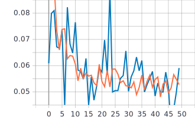
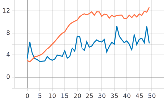

Лабораторная работа #2.
====
Решение задачи классификации изображений из набора данных Oregon Wildlife с использованием нейронных сетей глубокого обучения и техники обучения Transfer Learning
----
1)Обучить нейронную сеть EfficientNet-B0 (случайное начальное приближение) для решения задачи классификации изображений Oregon WildLife.
----
В данном случае мы берем веса со случайным начальным приближением. Размерность входного изображения 224х224х3. Использовалась нейронная сеть EfficientNetB0:
```
EfficientNetB0(include_top=True, weights=None, classes=NUM_CLASSES)(inputs)
```
* **include_top = True** - значит, что мы включаем в сеть последний слой нейронной сети, который отвечает за классификацию изображений.  

* Поскольку мы берем веса со случайным начальным приближением, а не предобученные заранее, то **weights = None**

* **classes=NUM_CLASSES** количество классов,для классификации изображений, в нашем случае 20.

Графики обучения для нейронной сети EfficientNetB0 со случайным начальным приближением:
----

***Линейная диаграмма точности:***

***Линейная диаграмма потерь:*** 
   
 
 ***Анализ результатов:*** 
 Сеть не обучается, можно заметить оверфит (переобучение) поскольку для случайного начального приближения слишком выской темп обучения.
 
 2)С использованием техники обучения Transfer Learning обучить нейронную сеть EfficientNet-B0 (предобученную на базе изображений imagenet) для решения задачи классификации изображений Oregon WildLife.
---- 
***Transfer Learning*** - технология позволяющая использовать накопленный при решении одной задачи опыт для решения другой, аналогичной проблемы. Нейросеть сначала обучается на большом объеме данных, затем — на целевом наборе.
В нашем случае мы работаем с нейронной сетью EfficientNetB0 и используюем заранее предобученные веса на базе изображений ImageNet. Архитектура нейронной сети принимает вид:
```
  model = EfficientNetB0(input_tensor=inputs,include_top=False,pooling='avg', weights='imagenet')(inputs)
  model.trainable=False
  model = tf.keras.layers.Flatten()(model)
  outputs = tf.keras.layers.Dense(NUM_CLASSES, activation = tf.keras.activations.softmax)(model)
  return tf.keras.Model(inputs=inputs, outputs=outputs)
```
Где:  
* **include_top = False** -  нам не нужен верхий слой нейронов, отвечающий за классификацию (поскольку датасет ImageNet делится на 1000 классов, а у нас только 20) обучать мы будем как раз классификатор.
* **pooling='avg'** - Дополнительный режим объединения объектов, а **'avg'** - 
* **weights='imagenet'** - значит, что мы взяли заранее предобученные веса на базе 'imagenet'.
* **model.trainable=False** - заморозка всех слоев и обучение только верхних.
* Так же был уменьшен **lr - learning rate(скорость обучения)** c 0.001 до 0.0001


 
